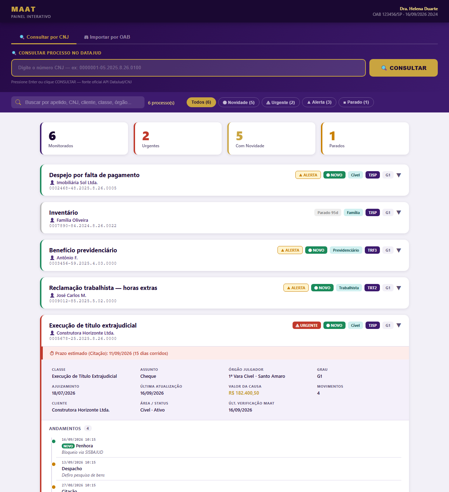
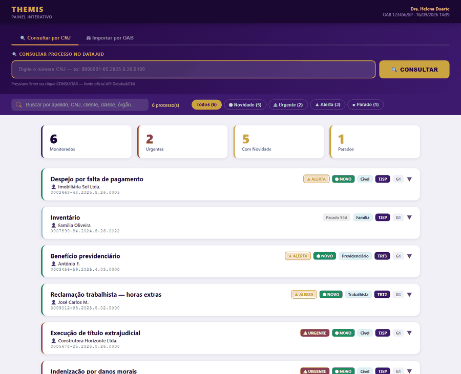

<div align="center">

# ⚖️ THEMIS Monitor

**Acompanhamento gratuito de processos judiciais brasileiros — direto da fonte oficial, sem sair do seu computador.**

[](https://github.com/Dramorimrodrigues/themis-monitor/actions/workflows/ci.yml)
[](LICENSE)
[](https://www.python.org/downloads/)
[](https://datajud-wiki.cnj.jus.br/api-publica/)
[](#instalação-em-3-passos)

[🇺🇸 English version](README.md)



</div>

---

## Por que o THEMIS existe

Todo advogado vive o mesmo ritual: abrir três portais de tribunal, digitar CAPTCHA, procurar processo por processo, torcer para não ter perdido nada. Ou pagar de R$ 80 a R$ 300 por mês por um serviço que faz isso por você — e guarda os dados dos seus clientes num servidor que não é seu.

O THEMIS faz o trabalho chato de graça, com dados oficiais, **na sua máquina**:

| | THEMIS | Serviços pagos | Consulta manual |
|---|:---:|:---:|:---:|
| Custo | **R$ 0** | R$ 80–300 / mês | seu tempo |
| Fonte dos dados | API oficial do CNJ | variada | portais |
| Onde ficam os dados | **no seu PC** | na nuvem deles | — |
| Detecta movimentação nova | ✅ | ✅ | 👀 |
| Alerta de urgência (penhora, liminar, prisão…) | ✅ | depende | ❌ |
| Prazo estimado a partir do andamento | ✅ | ✅ | ❌ |
| E-mail / WhatsApp | ✅ | ✅ | ❌ |
| Código aberto, auditável | ✅ | ❌ | — |

## O que ele faz

- 🔎 **Consulta cada processo** da sua lista na [API pública DataJud](https://datajud-wiki.cnj.jus.br/api-publica/) do Conselho Nacional de Justiça — a mesma base que alimenta as estatísticas oficiais.
- 🆕 **Detecta o que é novo** comparando com a última consulta e marca em verde.
- 🚨 **Classifica urgência** por palavras-chave nos andamentos: *penhora*, *bloqueio*, *liminar*, *mandado de prisão*, *leilão*… viram alerta vermelho.
- ⏱ **Estima prazos**: uma intimação vira "prazo estimado em 15 dias" automaticamente.
- 💤 **Aponta processos parados** há mais de 30 dias (configurável).
- 📊 **Gera relatório HTML** bonito, com busca e filtros, e **planilhas CSV** que abrem no Excel.
- 🖥 **Painel web local** para consultar qualquer CNJ na hora e importar processos em lote.
- 📧 **Avisa por e-mail ou WhatsApp** quando há novidade (opcional).
- 🔒 **Tudo local**: um arquivo SQLite na sua pasta. Sem cadastro, sem nuvem, sem assinatura.

<div align="center">

</div>

## O que ele NÃO faz (leia antes de confiar)

> **O THEMIS não substitui o PJe Push, o Diário Oficial nem a intimação eletrônica para contagem de prazo fatal.**

- O DataJud costuma refletir a movimentação **24 a 48 horas depois** do tribunal — às vezes mais, dependendo do tribunal.
- Por proteção de dados (LGPD), o DataJud **não traz nomes das partes nem advogados**. Você informa os processos; ele não descobre sozinho pela sua OAB (o painel ajuda com um guia para os portais).
- Processos em **segredo de justiça** não aparecem.
- Os "prazos estimados" são uma **conta simples em dias corridos** a partir da data do andamento — servem como lembrete, não como cálculo processual.

Use o THEMIS como radar diário. Para prazo, confira sempre a fonte oficial.

## Instalação em 3 passos

### Windows

1. **Instale o Python** em [python.org/downloads](https://www.python.org/downloads/) — marque **"Add Python to PATH"** na primeira tela.
2. **Baixe o THEMIS**: botão verde **Code → Download ZIP** aqui no GitHub, descompacte onde quiser.
3. **Clique duas vezes em `instalar.bat`**. Pronto.

Depois: abra `config.ini` (coloque seu nome e OAB), cole seus processos em `processos.txt` e clique em **`monitorar.bat`**.

### macOS / Linux

```bash
git clone https://github.com/Dramorimrodrigues/themis-monitor.git
cd themis-monitor
./themis.sh instalar
./themis.sh monitorar
```

## Uso no dia a dia

| Quero… | Windows | macOS / Linux |
|---|---|---|
| Acompanhar todos os meus processos | `monitorar.bat` | `./themis.sh monitorar` |
| Abrir o painel interativo | `painel.bat` | `./themis.sh painel` |
| Consultar um processo avulso | `consultar.bat` | `./themis.sh consultar 0000000-00.0000.0.00.0000` |
| Testar a conexão com o DataJud | `testar.bat` | `./themis.sh testar` |
| Descobrir meus processos pela OAB | `buscar-oab.bat` | `./themis.sh oab` |

### O arquivo `processos.txt`

Um processo por linha. Só o número já basta; o resto é opcional:

```
0000001-05.2025.8.26.0100
0000001-05.2025.8.26.0100 | Apelido do caso
0000001-05.2025.8.26.0100 | Apelido do caso | Nome do cliente | Cível
```

O THEMIS **identifica o tribunal pelo número** e **valida o dígito verificador** — um número digitado errado é avisado antes de consultar.

### Rodar sozinho todo dia

**Windows:** Agendador de Tarefas → Criar Tarefa Básica → Diariamente 07:00 → Iniciar um programa → `monitorar.bat`.
**macOS/Linux:** `crontab -e` e adicione `0 7 * * * /caminho/themis-monitor/themis.sh monitorar --sem-navegador`.

### Notificações (opcional)

Edite a seção `[notificacoes]` do `config.ini`:

- **E-mail (Gmail):** ative a verificação em duas etapas, crie uma [senha de aplicativo](https://myaccount.google.com/apppasswords) e preencha `email_ativo = sim`, remetente, senha e destinatário.
- **WhatsApp (CallMeBot, gratuito):** siga as instruções que estão no próprio `config.ini`.

## Tribunais suportados

Todos os que o DataJud expõe — **92 tribunais**: STF, STJ, TST, TSE, STM, os 6 TRFs, os 24 TRTs, os 27 TJs, os 27 TREs e os 3 TJMs. O tribunal é deduzido automaticamente do número CNJ.

## Segurança e privacidade

- Servidor do painel escuta **apenas em 127.0.0.1** e recusa requisições que não venham do próprio painel.
- A única chave no código é a **chave pública oficial** que o CNJ publica para a API DataJud — não há credencial sua no repositório.
- HTTPS **sempre validado**; SQL parametrizado; todo texto vindo do tribunal é escapado antes de virar HTML; células de CSV protegidas contra fórmulas.
- `config.ini`, `processos.txt` e o banco estão no `.gitignore`.

Detalhes e como reportar falhas: [SECURITY.md](SECURITY.md).

## Por dentro

```
themis.py                ← ponto de entrada (monitorar | painel | consultar | testar | oab)
themis/
  cnj.py                 ← limpar, formatar, validar dígito, identificar tribunal
  constantes.py          ← catálogo de tribunais, palavras-chave, prazos
  analise.py             ← urgência, prazos estimados, formatação
  config.py              ← config.ini, processos.txt
  banco.py               ← SQLite: gravação, novidades, backup
  datajud.py             ← cliente HTTP da API do CNJ
  notificacoes.py        ← e-mail e WhatsApp
  relatorio.py           ← HTML e CSV
  painel.py              ← servidor web local
  descoberta_oab.py      ← guia de descoberta por OAB
tests/                   ← pytest, sem acesso à rede
```

Python puro: as únicas dependências são `requests` e `truststore`. Testes rodam em Windows e Linux a cada commit.

## Roadmap

- [ ] Editar apelido/cliente/área direto no painel
- [ ] Botão "Atualizar agora" no painel
- [ ] Exportar PDF
- [ ] Instalador `.exe` sem precisar do Python
- [ ] Descoberta automática por OAB (depende dos portais abrirem API sem CAPTCHA)
- [ ] Versão multiusuário para escritórios

Quer ajudar? Veja o [CONTRIBUTING.md](CONTRIBUTING.md).

## Autoria e licença

Criado por **Márcio Luis Amorim**, advogado (OAB/RJ) e membro da Comissão de Inteligência Artificial da OAB/RJ, a partir de uma ferramenta desenvolvida para uso interno do seu escritório. Desenvolvido com apoio de IA (Claude, Anthropic).

Código sob licença **MIT** — use, modifique e distribua à vontade, mantendo o aviso de copyright:

```
Copyright (c) 2026 Márcio Luis Amorim
```

Se o THEMIS te poupou uma hora de portal, deixe uma ⭐ — ajuda outros advogados a encontrarem o projeto.

---

<div align="center">
<sub>THEMIS Monitor não tem vínculo com o CNJ ou com qualquer tribunal. DataJud é um serviço público do Conselho Nacional de Justiça.</sub>
</div>
